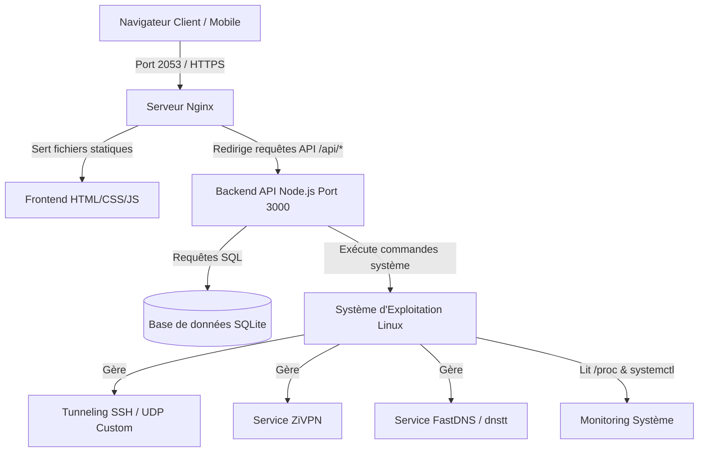

# ENCYCLOPÉDIE ET MANUEL DE RÉFÉRENCE : VPS DASHBOARD MANAGER
Un guide de référence pour le déploiement automatique d'un tableau de bord de monitoring système et d'un gestionnaire de comptes VPN multi-protocoles (UDP Custom, ZiVPN, FastDNS) pour les serveurs Linux.

---

## TABLE DES MATIÈRES
1. [INTRODUCTION ET PRÉSENTATION GÉNÉRALE](#1-introduction-et-présentation-générale)
2. [ARCHITECTURE TECHNIQUE DU PROJET](#2-architecture-technique-du-projet)
3. [DÉTAIL DES COMPOSANTS ET PROTOCOLES VPN](#3-détail-des-composants-et-protocoles-vpn)
   - [A. UDP Custom (SSH + UDPGW)](#a-udp-custom-ssh--udpgw)
   - [B. UDP ZiVPN](#b-udp-zivpn)
   - [C. FastDNS (dnstt)](#c-fastdns-dnstt)
4. [RÈGLES DE SÉCURITÉ ET PORTS RÉSEAU](#4-règles-de-sécurité-et-ports-réseau)
5. [MONITORING SYSTÈME ET RELEVÉ DE LA BANDE PASSANTE](#5-monitoring-système-et-relevé-de-la-bande-passante)
6. [ZONES MODIFIABLES ET CONFIGURATION DE L'APPLICATION (.env)](#6-zones-modifiables-et-configuration-de-lapplication-env)
7. [GUIDE D'INTÉGRATION D'UN NOUVEAU BOT (DANS LE TABLEAU DE BORD)](#7-guide-dintégration-dun-nouveau-bot-dans-le-tableau-de-bord)
8. [GUIDE DE DÉPLOIEMENT RAPIDE ET COMMANDES DE MAINTENANCE](#8-guide-de-déploiement-rapide-et-commandes-de-maintenance)

---

## 1. INTRODUCTION ET PRÉSENTATION GÉNÉRALE

Ce projet est une solution complète d'administration et de gestion pour les serveurs privés virtuels (VPS) sous environnement Linux. Conçu pour être extrêmement léger et fonctionner sans difficulté sur des machines limitées à **1 Go de RAM** (comme les instances d'entrée de gamme AWS EC2), il remplace les interfaces d'administration lourdes par une suite logicielle minimaliste et ultra-performante.

Le projet remplit deux fonctions majeures :
1. **Le monitoring matériel et logiciel** : Un tableau de bord web affichant en temps réel l'utilisation du processeur (CPU), de la mémoire physique (RAM), de la mémoire d'échange (Swap), du disque dur, du processeur graphique (GPU Nvidia) si disponible, de la vitesse du réseau, de la bande passante consommée sur le mois (Egress) ainsi que l'état d'un bot ou d'un processus géré.
2. **Le gestionnaire de comptes VPN** : Une base de données utilisateur SQLite qui permet la création, la modification, la suspension et la suppression de comptes sur trois protocoles de tunneling distincts, avec un suivi de consommation précis par utilisateur.

---

## 2. ARCHITECTURE TECHNIQUE DU PROJET

Le projet est divisé en deux parties indépendantes mais connectées :

* **Le Frontend (Dossier `frontend/`)** : Une application web monopage (SPA) construite en HTML, JavaScript natif et CSS pur (sans frameworks lourds). Elle communique avec l'API du serveur via des requêtes HTTP asynchrones.
* **Le Backend (Dossier `backend/`)** : Un serveur d'API codé en Node.js utilisant le framework minimaliste Express et une base de données relationnelle légère SQLite. Ce backend interagit directement avec le système d'exploitation pour récupérer les statistiques matérielles et exécuter les commandes d'administration (création d'utilisateurs système, modification des règles `iptables`, rechargement des services).



---

## 3. DÉTAIL DES COMPOSANTS ET PROTOCOLES VPN

Le gestionnaire de comptes VPN contrôle et synchronise l'accès à trois protocoles distincts. Chacun de ces protocoles répond à un type d'usage ou de contournement réseau particulier.

### A. UDP Custom (SSH + UDPGW)
* **Description** : Repose sur les comptes utilisateurs Linux standard (système). Les connexions SSH permettent d'établir des tunnels TCP (Socks5 ou SSH Direct). Pour faire transiter le trafic UDP (essentiel pour les applications de messagerie vocale, les jeux en ligne et le streaming), le serveur exécute en arrière-plan un service **BadVPN UDP Gateway (udpgw)**.
* **Méthode d'installation** : Le script d'installation configure OpenSSH pour autoriser le port-forwarding pour un groupe d'utilisateurs spécifique appelé `vpnusers`, tout en leur interdisant tout accès shell (la commande forcée est configurée à `/bin/false`). 
* **Comment fonctionne la facturation/quota** : Les octets transitant par ce protocole sont enregistrés en marquant chaque paquet sortant appartenant à l'UID de l'utilisateur système via la table `iptables`.

### B. UDP ZiVPN
* **Description** : ZiVPN est un protocole de tunneling UDP rapide, conçu pour acheminer directement les paquets réseau à haute performance. Il utilise un fichier de configuration centralisé qui contient la liste des mots de passe autorisés.
* **Méthode d'installation** : Le script installe le binaire officiel de ZiVPN, configure un service systemd autonome (`zivpn.service`) et lui associe son propre fichier de configuration JSON dans `/etc/zivpn/config.json`.
* **Comment fonctionne la facturation/quota** : Lors de la création ou modification d'un compte sur le panel, le backend régénère dynamiquement la liste des mots de passe actifs dans `/etc/zivpn/config.json` et redémarre le service `zivpn`.

### C. FastDNS (dnstt)
* **Description** : FastDNS s'appuie sur le protocole **dnstt** pour réaliser du tunneling DNS. Il encapsule le trafic Internet dans des requêtes DNS légitimes envoyées à un résolveur public. C'est l'ultime recours de contournement lorsque tous les ports réseau standard sont bloqués ou bridés par un opérateur.
* **Méthode d'installation** : Le script télécharge `dnstt-server` et génère une paire de clés privées/publiques asymétriques Ed25519 dans `/etc/dnstt/`. Le service `dnstt.service` est lancé et écoute sur le port 5300. Une règle de redirection de port `iptables` nat est mise en place pour rediriger tout trafic UDP arrivant sur le port standard DNS (53) vers le port 5300.
* **Comment fonctionne la facturation/quota** : Tout comme pour le protocole UDP Custom, le serveur relie l'utilisateur au compte système Linux correspondant afin de mesurer sa consommation par utilisateur via les paquets `iptables`.

---

## 4. RÈGLES DE SÉCURITÉ ET PORTS RÉSEAU

Pour que le dashboard et les services VPN fonctionnent correctement, certains ports doivent être ouverts au niveau de votre pare-feu (UFW en local et les Groupes de Sécurité / Security Groups chez votre fournisseur cloud comme AWS EC2) :

### Tableau des ports réseau requis

| Port | Protocole | Direction | Service | Description |
| :--- | :--- | :--- | :--- | :--- |
| **2053** | TCP | Entrant | Nginx | Interface d'accès web publique au Dashboard |
| **3000** | TCP | Local (127.0.0.1) | Node.js API | API Backend (bloquée en externe, Nginx fait le relais) |
| **22** | TCP | Entrant | OpenSSH | Accès administratif SSH + Point d'accès **UDP Custom** et **FastDNS** |
| **36712** | UDP | Entrant | badvpn-udpgw | Passerelle UDP Gateway pour les paquets UDP d'UDP Custom |
| **5667** | UDP | Entrant | ZiVPN | Port d'écoute par défaut du serveur **UDP ZiVPN** |
| **53** | UDP | Entrant | BIND9 / iptables | Port DNS standard redirigé vers le serveur **FastDNS** |
| **5300** | UDP | Entrant | dnstt-server | Port d'écoute interne réel de **FastDNS (dnstt)** |

> [!WARNING]
> N'ouvrez jamais le port `3000` au trafic externe. L'accès à l'API doit impérativement transiter par le reverse proxy sécurisé de Nginx (port `2053`) pour éviter toute faille de sécurité ou accès non autorisé à la base de données.

---

## 5. MONITORING SYSTÈME ET RELEVÉ DE LA BANDE PASSANTE

Le tableau de bord assure une surveillance constante des composants physiques et logiciels :

### A. Détection Matérielle
* **Processeur (CPU)** : Lecture en continu des temps d'inactivité du processeur via le module `os` de Node.js. Calcul du pourcentage d'utilisation globale de tous les cœurs physiques.
* **Mémoire RAM** : Calcul basé sur la commande système `free -b` (en octets), permettant d'extraire la mémoire totale, la mémoire réellement utilisée, la mémoire disponible, et celle occupée par les caches d'E/S (Buffer/Cache).
* **Mémoire Swap** : Permet de voir si le système manque de RAM physique et commence à décharger sur le disque dur. Mesurée séparément de la RAM avec sa propre jauge d'activité.
* **Disque Dur** : Analyse de l'espace sur la partition racine `/` à l'aide de la commande `df -B1 /`.
* **Processeur Graphique (GPU)** : Recherche de la présence d'une puce graphique Nvidia en interrogeant l'outil d'administration `nvidia-smi`. Si aucune puce n'est détectée, la carte affiche automatiquement "N/A" sans faire planter le dashboard.

### B. Consommation de Bande Passante (Egress)
* Le volume de données réseau sortantes est suivi de deux manières :
  1. **En temps réel** : Lecture du fichier système `/proc/net/dev` pour calculer le débit instantané en Ko/s ou Mo/s.
  2. **Historique mensuel** : Utilisation de l'outil système léger `vnstat` qui comptabilise le volume total de données consommées. Le dashboard compare ce volume au quota configuré (par exemple les 100 Go offerts mensuellement par AWS dans son offre gratuite) et l'affiche sous forme de barre de progression.

---

## 6. ZONES MODIFIABLES ET CONFIGURATION DE L'APPLICATION (.env)

Afin d'éviter de laisser des informations personnelles en dur dans le code (mots de passe, adresses IP, chemins d'accès), toutes les configurations sont centralisées dans le fichier `.env` situé dans le répertoire `backend/`. 

Lors de l'installation, un fichier d'exemple `.env.example` est fourni. Voici les variables configurables que vous pouvez modifier à tout moment :

* **`PORT`** : Le port réseau interne sur lequel l'API Node.js va tourner (par défaut `3000`).
* **`DATABASE_PATH`** : Le chemin vers le fichier de base de données SQLite (par défaut `./database.db` ou `/opt/vpn_dashboard/backend/database.db`).
* **`ADMIN_PASSWORD`** : Le mot de passe d'administration par défaut requis pour le protocole ZiVPN (remplace tout mot de passe confidentiel).
* **`ZIVPN_CONFIG_PATH`** : Le chemin d'accès vers le fichier JSON de configuration du service ZiVPN (par défaut `/etc/zivpn/config.json`).
* **`NETWORK_INTERFACE`** : L'interface réseau physique du serveur à écouter pour les statistiques (ex: `eth0`, `enX0`). Laissez vide pour laisser le script la détecter de façon autonome.
* **`EGRESS_LIMIT_GB`** : La limite de données sortantes en Go (ex: `100` pour AWS). Vous pouvez l'augmenter si vous avez un autre forfait.
* **`BOT_PM2_NAME`** : Le nom du processus PM2 du bot à surveiller (ex: `my-whatsapp-bot`).
* **`BOT_LOGS_OUT_PATH`** : Le chemin absolu du fichier de log standard généré par PM2 pour le bot.
* **`BOT_LOGS_ERR_PATH`** : Le chemin absolu du fichier de log d'erreur du bot.

---

## 7. GUIDE D'INTÉGRATION D'UN NOUVEAU BOT (DANS LE TABLEAU DE BORD)

Le dashboard permet de surveiller n'importe quel robot informatique (qu'il s'agisse d'un bot WhatsApp, Telegram, Discord, ou d'un script écrit en Python, Node.js, etc.) et de le contrôler (démarrer / arrêter / redémarrer) via l'interface web.

Pour intégrer un nouveau bot, suivez ces 3 étapes :

### Étape 1 : Enregistrer votre bot dans PM2
PM2 doit gérer le processus de votre bot pour que le dashboard puisse interagir avec lui. Allez dans le répertoire de votre bot et démarrez-le en lui attribuant un nom :
```bash
# Exemple pour un bot Node.js
pm2 start app.js --name "mon-nouveau-bot"

# Exemple pour un bot Python
pm2 start bot.py --name "mon-nouveau-bot" --interpreter python3
```
Sauvegardez la configuration de PM2 pour qu'il se relance au reboot :
```bash
pm2 save
```

### Étape 2 : Configurer les variables d'environnement du Dashboard
Ouvrez le fichier de configuration `.env` de votre dashboard :
```bash
nano /opt/vpn_dashboard/backend/.env
```
Modifiez les variables pour y associer le nom du processus et les chemins de logs créés par PM2 :
```env
BOT_PM2_NAME=mon-nouveau-bot
BOT_LOGS_OUT_PATH=/root/.pm2/logs/mon-nouveau-bot-out.log
BOT_LOGS_ERR_PATH=/root/.pm2/logs/mon-nouveau-bot-error.log
```
*(Remplacez `/root/` par `/home/votre_utilisateur/` selon le dossier de l'utilisateur qui a démarré PM2).*

### Étape 3 : Relancer le Dashboard pour appliquer
Redémarrez le dashboard pour qu'il prenne en compte ces modifications :
```bash
pm2 restart vpn-dashboard
```
Désormais, le statut de votre nouveau bot, son occupation CPU, sa mémoire RAM et ses journaux de logs en direct s'afficheront sur l'interface du Dashboard dans l'onglet **Monitoring**. Vous pourrez le contrôler d'un simple clic.

---

## 8. GUIDE DE DÉPLOIEMENT RAPIDE ET MAINTENANCE

### Installation automatique (sur le serveur de destination)
Clonez ce dépôt ou transférez-le sur votre serveur vierge, puis exécutez le script d'installation en tant que `root` :
```bash
chmod +x install.sh
sudo ./install.sh
```
L'installateur vous guidera en vous posant quelques questions simples (choix des ports, mot de passe admin, nom de domaine FastDNS).

### Commandes de Maintenance utiles

#### Gérer le Dashboard (PM2)
* **Consulter les logs en temps réel du dashboard** :
  ```bash
  pm2 logs vpn-dashboard
  ```
* **Redémarrer le backend du dashboard** :
  ```bash
  pm2 restart vpn-dashboard
  ```

#### Gérer les protocoles VPN (Systemd)
* **Vérifier l'état de fonctionnement des serveurs VPN** :
  ```bash
  sudo systemctl status badvpn-udpgw
  sudo systemctl status zivpn
  sudo systemctl status dnstt
  ```
* **Redémarrer un protocole en cas de panne** :
  ```bash
  sudo systemctl restart zivpn
  ```
